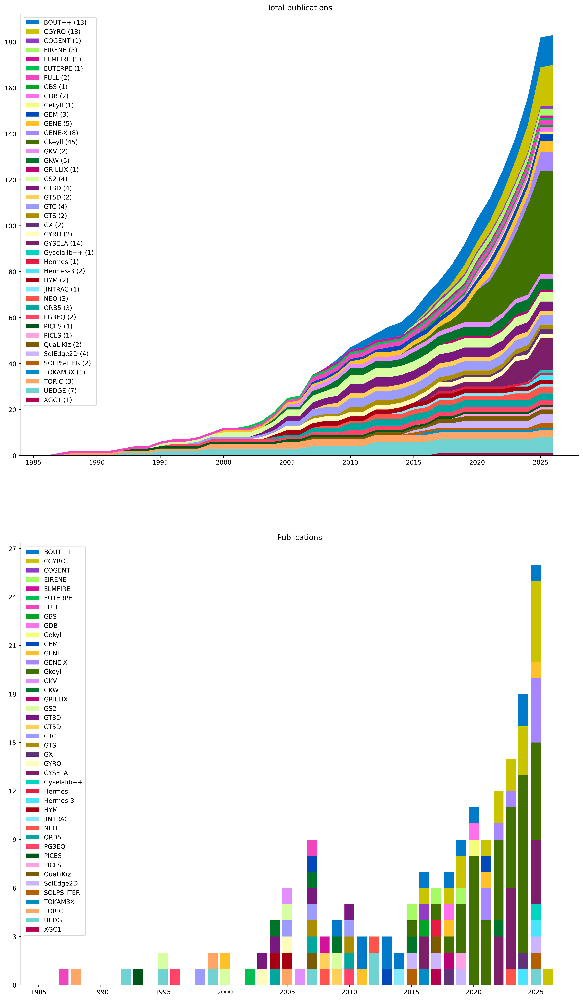

# FusionArena

## Publications

- Benchmarking core turbulence and transport predictions for an inductive compact tokamak reactor plasma. Holland at el. (2026) [10.1063/5.0302522](https://doi.org/10.1063/5.0302522)
  - CGYRO
- Gyrokinetic profile prediction and validation of a negative triangularity plasma in ASDEX Upgrade. Bielajew at el. (2025) [10.1088/1741-4326/adef68](https://doi.org/10.1088/1741-4326/adef68)
  - CGYRO
- Gyselalib++: A Portable C++ Library for Semi-Lagrangian Kinetic and Gyrokinetic Simulations. Bourne at el. (2025) [10.21105/joss.08582](https://doi.org/10.21105/joss.08582)
  - Gyselalib++
- Effects of oxidation and impurities in lithium surfaces on the emitting wall plasma sheath. Bradshaw at el. (2025) [10.1063/5.0258265](https://doi.org/10.1063/5.0258265)
  - Gkeyll
- Effect of modulated heat source on diffusive and avalanche-like transport. Cho at el. (2025) [10.1088/1741-4326/adb2a4](https://doi.org/10.1088/1741-4326/adb2a4)
  - GYSELA
- Dynamic mode decomposition for gyrokinetic eigenmode analysis. Dudkovskaia at el. (2025) [10.1088/1361-6587/addb73](https://doi.org/10.1088/1361-6587/addb73)
  - CGYRO
- Turbulence and transport in spectrally accelerated full-*f* gyrokinetic simulations. Frei at el. (2025) [10.1088/1741-4326/ae114a](https://doi.org/10.1088/1741-4326/ae114a)
  - GENE-X
- Spectrally accelerated edge and scrape-off layer gyrokinetic turbulence simulations. Frei at el. (2025) [10.1016/j.cpc.2025.109817](https://doi.org/10.1016/j.cpc.2025.109817)
  - GENE-X
- Investigation of the sheared flows and staircases with a full-wave 2D synthetic diagnostic FeDoT. Glasser at el. (2025) [10.1088/1361-6587/adb519](https://doi.org/10.1088/1361-6587/adb519)
  - GYSELA
- A moment-conserving discontinuous Galerkin representation of the relativistic Maxwellian distribution. Johnson at el. (2025) [10.1017/S0022377825100718](https://doi.org/10.1017/S0022377825100718)
  - Gkeyll
- A parallel-kinetic-perpendicular-moment model for magnetised plasmas. June at el. (2025) [10.1017/S0022377825100706](https://doi.org/10.1017/S0022377825100706)
  - Gkeyll
- Verification of fast ion and rotation effects on turbulence through comparison of GENE and CGYRO with L-mode plasmas in KSTAR. Kim at el. (2025) [10.1088/1741-4326/addc7e](https://doi.org/10.1088/1741-4326/addc7e)
  - GENE, CGYRO
- Analysis of the impact of parallel magnetic fluctuations on linear gyrokinetic stability in NSTX-U and verification of gyro-fluid models. Kinsey at el. (2025) [10.1063/5.0270873](https://doi.org/10.1063/5.0270873)
  - CGYRO
- Controlling impurity transport in 5D gyrokinetic simulations using a transport barrier. Lo-Cascio at el. (2025) [10.1088/1741-4326/adc5ea](https://doi.org/10.1088/1741-4326/adc5ea)
  - GYSELA
- Cross-code comparison of the edge codes SOLPS-ITER, SOLEDGE2D and UEDGE in modelling a high-power neon-seeded scenario in the DTT. Moscheni at el. (2025) [10.1088/1741-4326/ada048](https://doi.org/10.1088/1741-4326/ada048)
  - SOLPS-ITER, SolEdge2D, UEDGE
- A kinetic line-driven radiation operator and its application to Gyrokinetics. Roeltgen at el. (2025) [10.1088/1741-4326/adff28](https://doi.org/10.1088/1741-4326/adff28)
  - Gkeyll
- Interplay between ion temperature gradient and parallel velocity gradient instabilities in cylindrical geometry: Water-bag vs 5D gyrokinetics. Rouyer at el. (2025) [10.1063/5.0274782](https://doi.org/10.1063/5.0274782)
  - GYSELA
- Minimizing CGYRO HPC Communication Costs in Ensembles with XGYRO by Sharing the Collisional Constant Tensor Structure. Sfiligoi at el. (2025) [10.1145/3750720.375730](https://doi.org/10.1145/3750720.375730)
  - CGYRO
- Direct comparison of gyrokinetic and fluid scrape-off layer simulations. Shukla at el. (2025) [10.1063/5.0268104](https://doi.org/10.1063/5.0268104)
  - Gkeyll
- General kinetic ion-induced electron emission model for metallic walls applied to biased Z-pinch electrodes. Skolar at el. (2025) [10.1063/5.0261942](https://doi.org/10.1063/5.0261942)
  - Gkeyll
- OpenACC and OpenMP-Accelerated Fortran/C++ Gyrokinetic Fusion Code GENE-X for Heterogeneous Architectures. Trilaksono at el. (2025) [10.1145/3732775.3733587](https://doi.org/10.1145/3732775.3733587)
  - GENE-X
- Simulations of edge and SOL turbulence in diverted negative and positive triangularity plasmas. Ulbl at el. (2025) [10.1088/1741-4326/adfd70](https://doi.org/10.1088/1741-4326/adfd70)
  - GENE-X
- Modeling of convective cells, turbulence, and transport induced by a radio-frequency antenna in the tokamak boundary plasma. Umansky at el. (2025) [10.1088/1361-6587/ae1bd1](https://doi.org/10.1088/1361-6587/ae1bd1)
  - Hermes-3
- The simulation of mode coupling during ELM crash by using BOUT++. Zhu at el. (2025) [10.1063/5.0270211](https://doi.org/10.1063/5.0270211)
  - BOUT++
- Plasma edge and scrape-off layer turbulence in gyrokinetic simulations of negative triangularity plasmas. Bernard at el. (2024) [10.1088/1361-6587/ad8186](https://doi.org/10.1088/1361-6587/ad8186)
  - Gkeyll
- Experimental Study of Alfvén Wave Reflection from an Alfvén-speed Gradient Relevant to the Solar Coronal Holes. Bose at el. (2024) [10.3847/1538-4357/ad528f](https://doi.org/10.3847/1538-4357/ad528f)
  - Gkeyll
- Energy-dependent implementation of secondary electron emission models in continuum kinetic sheath simulations. Bradshaw and Srinivasan (2024) [10.1088/1361-6595/ad331c](https://doi.org/10.1088/1361-6595/ad331c)
  - Gkeyll
- The kinetic analog of the pressure-strain interaction. Conley at el. (2024) [10.1063/5.0231200](https://doi.org/10.1063/5.0231200)
  - Gkeyll
- Hermes-3: Multi-component plasma simulations with BOUT++. Dudson at el. (2024) [10.1016/j.cpc.2023.108991](https://doi.org/10.1016/j.cpc.2023.108991)
  - Hermes-3, BOUT++
- Scale Separation Effects on Simulations of Plasma Turbulence. Edyvean at el. (2024) [10.3847/1538-4357/ad5cf5](https://doi.org/10.3847/1538-4357/ad5cf5)
  - Gkeyll
- Conservative discontinuous Galerkin interpolation: Sheared boundary conditions. Francisquez at el. (2024) [10.1016/j.cpc.2024.109109](https://doi.org/10.1016/j.cpc.2024.109109)
  - Gkeyll
- A two-dimensional numerical study of ion-acoustic turbulence. Liu at el. (2024) [10.1017/S0022377824000060](https://doi.org/10.1017/S0022377824000060)
  - Gkeyll
- GX: a GPU-native gyrokinetic turbulence code for tokamak and stellarator design. Mandell at el. (2024) [10.1017/S0022377824000631](https://doi.org/10.1017/S0022377824000631)
  - GX
- Weak baselines and reporting biases lead to overoptimism in machine learning for fluid-related partial differential equations. McGreivy and Hakim (2024) [10.1038/s42256-024-00897-5](https://doi.org/10.1038/s42256-024-00897-5)
  - Gkeyll
- Predictive modeling of NSTX discharges with the updated multi-mode anomalous transport module. Rafiq at el. (2024) [10.1088/1741-4326/ad4d01](https://doi.org/10.1088/1741-4326/ad4d01)
  - CGYRO
- The Effect of Spatially Varying Collision Frequency on the Development of the Rayleigh-Taylor Instability. Rodman at el. (2024) [10.3847/1538-4357/ad3359](https://doi.org/10.3847/1538-4357/ad3359)
  - Gkeyll
- Core performance predictions in projected SPARC first-campaign plasmas with nonlinear CGYRO. Rodriguez-Fernandez at el. (2024) [10.1063/5.0209752](https://doi.org/10.1063/5.0209752)
  - CGYRO
- The benefits of HBM memory for CPU-based fusion simulations. Sfiligoi at el. (2024) [10.1145/3626203.3670563](https://doi.org/10.1145/3626203.3670563)
  - CGYRO
- Global fluid turbulence simulations in the scrape-off layer of a stellarator island divertor. Shanahan at el. (2024) [10.1017/S002237782400045X](https://doi.org/10.1017/S002237782400045X)
  - BOUT++
- Electron energization in reconnection: Eulerian vs Lagrangian perspectives. TenBarge at el. (2024) [10.1063/5.0184710](https://doi.org/10.1063/5.0184710)
  - Gkeyll
- Electron Influence on the Parallel Proton Firehose Instability in 10-moment, Multifluid Simulations. Walters at el. (2024) [10.3847/1538-4357/ad7c47](https://doi.org/10.3847/1538-4357/ad7c47)
  - Gkeyll
- Effect of neutral interactions on parallel transport and blob dynamics in gyrokinetic scrape-off layer simulations. Bernard at el. (2023) [10.1063/5.0160588](https://doi.org/10.1063/5.0160588)
  - Gkeyll
- Solver comparison for Poisson-like equations on tokamak geometries. Bourne at el. (2023) [10.1016/j.jcp.2023.112249](https://doi.org/10.1016/j.jcp.2023.112249)
  - GYSELA
- An investigation of shock formation vs shock mitigation of colliding plasma jets. Cagas at el. (2023) [10.1063/5.0135389](https://doi.org/10.1063/5.0135389)
  - Gkeyll
- Verification and accuracy check of simulations with PoPe and iPoPe. Cartier-Michaud at el. (2023) [10.1016/j.jcp.2022.111759](https://doi.org/10.1016/j.jcp.2022.111759)
- Toward continuum gyrokinetic study of high-field mirrors. Francisquez at el. (2023) [10.1063/5.0152440](https://doi.org/10.1063/5.0152440)
  - Gkeyll
- The problem of capturing marginality in model reductions of turbulence. Gillot at el. (2023) [10.1088/1361-6587/acc276](https://doi.org/10.1088/1361-6587/acc276)
  - GYSELA
- Phase-space Energization of Ions in Oblique Shocks. Juno at el. (2023) [10.3847/1538-4357/acaf53](https://doi.org/10.3847/1538-4357/acaf53)
  - Gkeyll
- Self-consistent gyrokinetic modeling of turbulent and neoclassical tungsten transport in toroidally rotating plasmas. Lim at el. (2023) [10.1063/5.0157428](https://doi.org/10.1063/5.0157428)
  - GYSELA
- Optimization and Portability of a Fusion OpenACC-based FORTRAN HPC Code from NVIDIA to AMD GPUs. Sfiligoi at el. (2023) [10.1145/3569951.3597545](https://doi.org/10.1145/3569951.3597545)
  - CGYRO
- Continuum kinetic investigation of the impact of bias potentials in the current saturation regime on sheath formation. Skolar at el. (2023) [10.1063/5.0134656](https://doi.org/10.1063/5.0134656)
  - Gkeyll
- A flexible gyro-fluid system of equations. Staebler at el. (2023) [10.1063/5.0159054](https://doi.org/10.1063/5.0159054)
  - CGYRO
- Influence of collisions on the validation of global gyrokinetic simulations in the edge and scrape-off layer of TCV. Ulbl at el. (2023) [10.1063/5.0144688](https://doi.org/10.1063/5.0144688)
  - GENE-X
- Impact of magnetic ripple on neoclassical equilibrium in gyrokinetic simulations. Varennes at el. (2023) [10.1088/1361-6587/acb79a](https://doi.org/10.1088/1361-6587/acb79a)
  - GYSELA, NEO
- Safety factor influence on the edge *E×B* velocity establishment in tokamak plasmas. Varennes at el. (2023) [10.1088/1361-6587/ad1653](https://doi.org/10.1088/1361-6587/ad1653)
  - GYSELA
- Comparing single-node and multi-node performance of an important fusion HPC code benchmark. Belli at el. (2022) [10.1145/3491418.3535130](https://doi.org/10.1145/3491418.3535130)
  - CGYRO
- Kinetic modeling of neutral transport for a continuum gyrokinetic code. Bernard at el. (2022) [10.1063/5.0087131](https://doi.org/10.1063/5.0087131)
  - Gkeyll
- Transport barrier onset and edge turbulence shortfall in fusion plasmas. Dif-Pradalier at el. (2022) [10.1038/s42005-022-01004-z](https://doi.org/10.1038/s42005-022-01004-z)
  - GYSELA, GKW
- Improved multispecies Dougherty collision. Francisquez at el. (2022) [10.1017/S0022377822000289](https://doi.org/10.1017/S0022377822000289)
  - Gkeyll
- Transport barrier in 5D gyrokinetic flux-driven simulations. Lo-Cascio at el. (2022) [10.1088/1741-4326/ac945d](https://doi.org/10.1088/1741-4326/ac945d)
  - GYSELA
- Turbulent broadening of electron heat-flux width in electromagnetic gyrokinetic simulations of a helical scrape-off layer model. Mandell at el. (2022) [10.1063/5.0082486](https://doi.org/10.1063/5.0082486)
  - Gkeyll
- Full-*f* electromagnetic gyrokinetic turbulence simulations of the edge and scrape-off layer of ASDEX Upgrade with GENE-X. Michels at el. (2022) [10.1063/5.0082413](https://doi.org/10.1063/5.0082413)
  - GENE-X
- Kinetic interpretation of the classical Rayleigh-Taylor instability. Rodman at el. (2022) [10.1103/PhysRevE.105.065209](https://doi.org/10.1103/PhysRevE.105.065209)
  - Gkeyll
- Nonlinear gyrokinetic predictions of SPARC burning plasma profiles enabled by surrogate modeling. Rodriguez-Fernandez at el. (2022) [10.1088/1741-4326/ac64b2](https://doi.org/10.1088/1741-4326/ac64b2)
  - CGYRO
- Synergy of Turbulent Momentum Drive and Magnetic Braking. Varennes at el. (2022) [10.1103/physrevlett.128.255002](https://doi.org/10.1103/physrevlett.128.255002)
  - GYSELA
- Electron cyclotron drift instability and anomalous transport: two-fluid moment theory and modeling. Wang at el. (2022) [10.1088/1361-6595/ac90e7](https://doi.org/10.1088/1361-6595/ac90e7)
  - Gkeyll
- A boundary value "reservoir problem" and boundary conditions for multi-moment multifluid simulations of sheaths. Cagas at el. (2021) [10.1063/5.0024510](https://doi.org/10.1063/5.0024510)
  - Gkeyll
- Wave trapping and *E×B* staircases. Garbet at el. (2021) [10.1063/5.0042930](https://doi.org/10.1063/5.0042930)
  - GYSELA
- Gyrokinetic benchmark of the electron temperature-gradient instability in the pedestal region. Hassan at el. (2021) [10.1063/5.0043006](https://doi.org/10.1063/5.0043006)
  - CGYRO, GEM, GENE
- Ultrafast electron holes in plasma phase space dynamics. Jenab at el. (2021) [10.1038/s41598-021-95652-w](https://doi.org/10.1038/s41598-021-95652-w)
  - Gkeyll
- A field-particle correlation analysis of a perpendicular magnetized collisionless shock. Juno at el. (2021) [10.1017/S0022377821000623](https://doi.org/10.1017/S0022377821000623)
  - Gkeyll
- Gyrokinetic modelling of light to heavy impurity transport in tokamaks. Lim at el. (2021) [10.1088/1741-4326/abe6b4](https://doi.org/10.1088/1741-4326/abe6b4)
  - GYSELA
- Turbulent field fluctuations in gyrokinetic and fluid plasmas. Mathews at el. (2021) [10.1063/5.0066064](https://doi.org/10.1063/5.0066064)
  - Gkeyll
- GENE-X: A full-*f* gyrokinetic turbulence code based on the flux-coordinate independent approach. Michels at el. (2021) [10.1016/j.cpc.2021.107986](https://doi.org/10.1016/j.cpc.2021.107986)
  - GENE-X
- Key impact of phase dynamics and diamagnetic drive on Reynolds stress in magnetic fusion plasmas. Sarazin at el. (2021) [10.1088/1361-6587/abf673](https://doi.org/10.1088/1361-6587/abf673)
  - GYSELA
- Implementation and verification of a conservative, multi-species, gyro-averaged, full-*f*, Lenard-Bernstein/Dougherty collision operator in the gyrokinetic code GENE-X. Ulbl at el. (2021) [10.1002/ctpp.202100180](https://doi.org/10.1002/ctpp.202100180)
  - GENE-X
- Investigating shear flow through continuum gyrokinetic simulations of limiter biasing in the Texas Helimak. Bernard at el. (2020) [10.1063/5.0003904](https://doi.org/10.1063/5.0003904)
  - Gkeyll
- Plasma-material boundary conditions for discontinuous Galerkin continuum-kinetic simulations, with a focus on secondary electron emission. Cagas at el. (2020) [10.1016/j.jcp.2019.109215](https://doi.org/10.1016/j.jcp.2019.109215)
  - Gkeyll
- Conservative discontinuous Galerkin scheme of a gyro-averaged Dougherty collision operator. Francisquez at el. (2020) [10.1088/1741-4326/aba0c9](https://doi.org/10.1088/1741-4326/aba0c9)
  - Gkeyll
- Fluid and gyrokinetic turbulence in open field-line, helical plasmas. Francisquez at el. (2020) [10.1063/5.0005333](https://doi.org/10.1063/5.0005333)
  - GDB, Gekyll
- Conservative discontinuous Galerkin schemes for nonlinear Dougherty-Fokker-Planck collision operators. Hakim at el. (2020) [10.1017/S0022377820000586](https://doi.org/10.1017/S0022377820000586)
  - Gkeyll
- Alias-Free, Matrix-Free, and Quadrature-Free Discontinuous Galerkin Algorithms for (Plasma) Kinetic Equations. Hakim and Juno (2020) [10.1109/SC41405.2020.00077](https://doi.org/10.1109/SC41405.2020.00077)
  - Gkeyll
- Continuum electromagnetic gyrokinetic simulations of turbulence in the tokamak scrape-off layer and laboratory devices. Hakim at el. (2020) [10.1063/1.5141157](https://doi.org/10.1063/1.5141157)
  - Gkeyll
- Simulations of divertor heat flux width using transport code with cross-field drifts under the BOUT++ framework. Li at el. (2020) [10.1063/1.5126884](https://doi.org/10.1063/1.5126884)
  - BOUT++
- Electromagnetic full-*f* gyrokinetics in the tokamak edge with discontinuous Galerkin methods. Mandell at el. (2020) [10.1017/S0022377820000070](https://doi.org/10.1017/S0022377820000070)
  - Gkeyll
- Exact and locally implicit source term solvers for multifluid-Maxwell systems. Wang at el. (2020) [10.1016/j.jcp.2020.109510](https://doi.org/10.1016/j.jcp.2020.109510)
  - Gkeyll
- Gyrokinetic continuum simulations of plasma turbulence in the Texas Helimak. Bernard at el. (2019) [10.1063/1.5085457](https://doi.org/10.1063/1.5085457)
  - Gkeyll
- Collisional gyrokinetic full-f particle-in-cell simulations on open field lines with PICLS. Boesl at el. (2019) [10.1002/ctpp.201900117](https://doi.org/10.1002/ctpp.201900117)
  - PICLS, full-f, particle-in-cell
- Multiscale-optimized plasma turbulence simulation on petascale architectures. Candy at el. (2019) [10.1016/j.compfluid.2019.04.016](https://doi.org/10.1016/j.compfluid.2019.04.016)
  - CGYRO
- Prediction of divertor heat flux width for ITER using BOUT++ transport and turbulence module. Li at el. (2019) [10.1088/1741-4326/ab0184](https://doi.org/10.1088/1741-4326/ab0184)
  - BOUT++
- Application of a two-fluid two-point model to SolEdge2D-EIRENE simulations of TCV H-mode plasma. Nespoli at el. (2019) [10.1016/j.nme.2018.11.026](https://doi.org/10.1016/j.nme.2018.11.026)
  - SolEdge2D, EIRENE
- CGYRO Performance on Power9 CPUs and Volta GPUs. Sfiligoi at el. (2019) [10.1007/978-3-030-02465-9_24](https://doi.org/10.1007/978-3-030-02465-9_24)
  - CGYRO
- Full-*f* gyrokinetic simulation of turbulence in a helical open-field-line plasma. Shi at el. (2019) [10.1063/1.5074179](https://doi.org/10.1063/1.5074179)
  - Gkeyll, full-f
- Temperature-dependent Saturation of Weibel-type Instabilities in Counter-streaming Plasmas. Skoutnev at el. (2019) [10.3847/2041-8213/ab0556](https://doi.org/10.3847/2041-8213/ab0556)
  - Gkeyll
- Discontinuous Galerkin algorithms for fully kinetic plasmas. Juno at el. (2018) [10.1016/j.jcp.2017.10.009](https://doi.org/10.1016/j.jcp.2017.10.009)
  - Gkeyll
- Calculation of two-dimension radial electric field in boundary plasmas by using BOUT++. Li at el. (2018) [10.1016/j.cpc.2018.03.003](https://doi.org/10.1016/j.cpc.2018.03.003)
  - BOUT++
- Laguerre-Hermite pseudo-spectral velocity formulation of gyrokinetics. Mandell at el. (2018) [10.1017/S0022377818000041](https://doi.org/10.1017/S0022377818000041)
  - GX
- Verification of GENE and GYRO with L-mode and I-mode plasmas in Alcator C-Mod. Mikkelsen at el. (2018) [10.1063/1.5018741](https://doi.org/10.1063/1.5018741)
  - GENE, CGYRO
- GRILLIX: a 3D turbulence code based on the flux-coordinate independent approach. Stegmeir at el. (2018) [10.1088/1361-6587/aaa373](https://doi.org/10.1088/1361-6587/aaa373)
  - GRILLIX
- GDB: A global 3D two-fluid model of plasma turbulence and transport in the tokamak edge. Zhu at el. (2018) [10.1016/j.cpc.2018.06.002](https://doi.org/10.1016/j.cpc.2018.06.002)
  - GDB
- Implementation of drift velocities and currents in SOLEDGE2D-EIRENE. Bufferand at el. (2017) [10.1016/j.nme.2016.11.031](https://doi.org/10.1016/j.nme.2016.11.031)
  - SolEdge2D, EIRENE
- Gyrokinetic projection of the divertor heat-flux width from present tokamaks to ITER. Chang at el. (2017) [10.1088/1741-4326/aa7efb](https://doi.org/10.1088/1741-4326/aa7efb)
  - XGC1
- Tractable flux-driven temperature, density, and rotation profile evolution with the quasilinear gyrokinetic transport model QuaLiKiz. Citrin at el. (2017) [10.1088/1361-6587/aa8aeb](https://doi.org/10.1088/1361-6587/aa8aeb)
  - QuaLiKiz
- Hermes: global plasma edge fluid turbulence simulations. Dudson and Leddy (2017) [10.1088/1361-6587/aa63d2](https://doi.org/10.1088/1361-6587/aa63d2)
  - Hermes
- Gyrokinetic continuum simulation of turbulence in a straight open-field-line plasma. Shi at el. (2017) [10.1017/S002237781700037X](https://doi.org/10.1017/S002237781700037X)
  - Gkeyll
- An approach to increase reliability of HPC simulation, application to the Gysela5D code. Bigot at el. (2016) [10.1051/proc/201653015](https://doi.org/10.1051/proc/201653015)
  - GYSELA
- A high-accuracy Eulerian gyrokinetic solver for collisional plasmas. Candy at el. (2016) [10.1016/j.jcp.2016.07.039](https://doi.org/10.1016/j.jcp.2016.07.039)
  - CGYRO
- Continuum kinetic modeling of the tokamak plasma edge. Dorf at el. (2016) [10.1063/1.4943106](https://doi.org/10.1063/1.4943106)
  - COGENT
- Verification of BOUT++ by the method of manufactured solutions. Dudson at el. (2016) [10.1063/1.4953429](https://doi.org/10.1063/1.4953429)
  - BOUT++
- A 5D gyrokinetic full-*f* global semi-Lagrangian code for flux-driven ion turbulence simulations. Grandgirard at el. (2016) [10.1016/j.cpc.2016.05.007](https://doi.org/10.1016/j.cpc.2016.05.007)
  - GYSELA
- The GBS code for tokamak scrape-off layer simulations. Halpern at el. (2016) [10.1016/j.jcp.2016.03.040](https://doi.org/10.1016/j.jcp.2016.03.040)
  - GBS
- The TOKAM3X code for edge turbulence fluid simulations of tokamak plasmas in versatile magnetic geometries. Tamain at el. (2016) [10.1016/j.jcp.2016.05.038](https://doi.org/10.1016/j.jcp.2016.05.038)
  - TOKAM3X
- Numerical modelling for divertor design of the WEST device with a focus on plasma-wall interactions. Bufferand at el. (2015) [10.1088/0029-5515/55/5/053025](https://doi.org/10.1088/0029-5515/55/5/053025)
  - SolEdge2D, EIRENE
- Enhanced stabilisation of trapped electron modes by collisional energy scattering in tokamaks. Manas at el. (2015) [10.1063/1.4922754](https://doi.org/10.1063/1.4922754)
  - GKW
- A gyrokinetic one-dimensional scrape-off layer model of an edge-localized mode heat pulse. Shi at el. (2015) [10.1063/1.4907160](https://doi.org/10.1063/1.4907160)
  - Gkeyll
- The new SOLPS-ITER code package. Wiesen at el. (2015) [10.1016/j.jnucmat.2014.10.012](https://doi.org/10.1016/j.jnucmat.2014.10.012)
  - SOLPS-ITER
- BOUT++: Recent and current developments. Dudson at el. (2014) [10.1017/S0022377814000816](https://doi.org/10.1017/S0022377814000816)
  - BOUT++
- JINTRAC: A System of Codes for Integrated Simulation of Tokamak Scenarios. Romanelli at el. (2014) [10.1585/pfr.9.3403023](https://doi.org/10.1585/pfr.9.3403023)
  - JINTRAC
- Benchmarking gyrokinetic simulations in a toroidal flux-tube. Chen at el. (2013) [10.1063/1.4821982](https://doi.org/10.1063/1.4821982)
  - GEM
- Five-field simulations of peeling-ballooning modes using BOUT++ code. Xia and Xu (2013) [10.1063/1.4801006](https://doi.org/10.1063/1.4801006)
  - BOUT++
- Six-field two-fluid simulations of peeling-ballooning modes using BOUT++. Xia at el. (2013) [10.1088/0029-5515/53/7/073009](https://doi.org/10.1088/0029-5515/53/7/073009)
  - BOUT++
- Full linearized Fokker-Planck collisions in neoclassical transport simulations. Belli and Candy (2012) [10.1088/0741-3335/54/1/015015](https://doi.org/10.1088/0741-3335/54/1/015015)
  - NEO
- Coupled core-edge simulations of H-mode buildup using the Fusion Application for Core-Edge Transport Simulations (FACETS) code. Hakim at el. (2012) [10.1063/1.3693148](https://doi.org/10.1063/1.3693148)
  - UEDGE
- Improving parallel scalability for edge plasma transport simulations with neutral gas species. McCourt at el. (2012) [10.1088/1749-4699/5/1/014012](https://doi.org/10.1088/1749-4699/5/1/014012)
  - UEDGE
- Simulation of edge localized modes using BOUT++. Dudson at el. (2011) [10.1088/0741-3335/53/5/054005](https://doi.org/10.1088/0741-3335/53/5/054005)
  - BOUT++
- The global version of the gyrokinetic turbulence code GENE. Görler at el. (2011) [10.1016/j.jcp.2011.05.034](https://doi.org/10.1016/j.jcp.2011.05.034)
  - GENE
- Vlasov modelling of parallel transport in a tokamak scrape-off layer. Manfredi at el. (2011) [10.1088/0741-3335/53/1/015012](https://doi.org/10.1088/0741-3335/53/1/015012)
  - edge-localized modes
- Nonlinear ELM simulations based on a nonideal peeling-ballooning model using the BOUT++ code. Xu at el. (2011) [10.1088/0029-5515/51/10/103040](https://doi.org/10.1088/0029-5515/51/10/103040)
  - BOUT++
- Gyrokinetic simulations of turbulent transport. Garbet at el. (2010) [10.1088/0029-5515/50/4/043002](https://doi.org/10.1088/0029-5515/50/4/043002)
  - GTC, GT3D, ORB5, PG3EQ, GTS
- Linearized model Fokker-Planck collision operators for gyrokinetic simulations. II. Numerical implementation and tests. Barnes at el. (2009) [10.1063/1.3155085](https://doi.org/10.1063/1.3155085)
  - GS2
- BOUT++: A framework for parallel plasma fluid simulations. Dudson at el. (2009) [10.1016/j.cpc.2009.03.008](https://doi.org/10.1016/j.cpc.2009.03.008)
  - BOUT++
- Study of ion turbulent transport and profile formations using global gyrokinetic full-*f* Vlasov simulation. Idomura at el. (2009) [10.1088/0029-5515/49/6/065029](https://doi.org/10.1088/0029-5515/49/6/065029)
  - GT5D
- The nonlinear gyro-kinetic flux tube code GKW. Peeters at el. (2009) [10.1016/j.cpc.2009.07.001](https://doi.org/10.1016/j.cpc.2009.07.001)
  - GKW
- Kinetic calculation of neoclassical transport including self-consistent electron and impurity dynamics. Belli and Candy (2008) [10.1088/0741-3335/50/9/095010](https://doi.org/10.1088/0741-3335/50/9/095010)
  - NEO
- Full *f* gyrokinetic method for particle simulation of tokamak transport. Heikkinen at el. (2008) [10.1016/j.jcp.2008.02.013](https://doi.org/10.1016/j.jcp.2008.02.013)
  - ELMFIRE
- Conservative global gyrokinetic toroidal full-*f* five-dimensional Vlasov simulation. Idomura at el. (2008) [10.1016/j.cpc.2008.04.005](https://doi.org/10.1016/j.cpc.2008.04.005)
  - GT5D
- A new gyrokinetic quasilinear transport model applied to particle transport in tokamak plasmas. Bourdelle at el. (2007) [10.1063/1.2800869](https://doi.org/10.1063/1.2800869)
  - QuaLiKiz
- Introducing FACETS, the Framework Application for Core-Edge Transport Simulations. Cary at el. (2007) [10.1088/1742-6596/78/1/012086](https://doi.org/10.1088/1742-6596/78/1/012086)
  - UEDGE
- Electromagnetic gyrokinetic *δf* particle-in-cell turbulence simulation with realistic equilibrium profiles and geometry. Chen and Parker (2007) [10.1016/j.jcp.2006.05.028](https://doi.org/10.1016/j.jcp.2006.05.028)
  - GEM
- A global collisionless PIC code in magnetic coordinates. Jolliet at el. (2007) [10.1016/j.cpc.2007.04.006](https://doi.org/10.1016/j.cpc.2007.04.006)
  - ORB5
- Toroidal Momentum Pinch Velocity due to the Coriolis Drift Effect on Small Scale Instabilities in a Toroidal Plasma. Peeters at el. (2007) [10.1103/PhysRevLett.98.265003](https://doi.org/10.1103/PhysRevLett.98.265003)
  - GKW
- Linear comparison of gyrokinetic codes with trapped electrons. Rewoldt at el. (2007) [10.1016/j.cpc.2007.06.017](https://doi.org/10.1016/j.cpc.2007.06.017)
  - GTC, GT3D, FULL
- Nonlocal properties of gyrokinetic turbulence and the role of *E×B* flow shear. Wang at el. (2007) [10.1063/1.2750647](https://doi.org/10.1063/1.2750647)
  - GTS
- Kinetic simulations of turbulent fusion plasmas. Idomura at el. (2006) [10.1016/j.crhy.2006.06.007](https://doi.org/10.1016/j.crhy.2006.06.007)
- Velocity-space structures of distribution function in toroidal ion temperature gradient turbulence. Watanabe and Sugama (2006) [10.1088/0029-5515/46/1/003](https://doi.org/10.1088/0029-5515/46/1/003)
  - GKV
- Advances and challenges in computational plasma science. Tang and Chan (2005) [10.1088/0741-3335/47/2/R01](https://doi.org/10.1088/0741-3335/47/2/R01)
  - HYM, GTC, GYRO, GS2, TORIC, GKV
- Kinetic effects on the stability properties of field-reversed configurations. II. Nonlinear evolution. Belova at el. (2004) [10.1063/1.1666293](https://doi.org/10.1063/1.1666293)
  - HYM
- The effect of a uniform radial electric field on the toroidal ion temperature gradient mode. Peeters and Strintzi (2004) [10.1063/1.1762876](https://doi.org/10.1063/1.1762876)
  - GKW
- First principles based simulations of instabilities and turbulence. Villard at el. (2004) [10.1088/0741-3335/46/12B/005](https://doi.org/10.1088/0741-3335/46/12B/005)
  - GT3D, ORB5
- An Eulerian gyrokinetic-Maxwell solver. Candy and Waltz (2003) [10.1016/S0021-9991(03)00079-2](https://doi.org/10.1016/S0021-9991(03)00079-2)
  - GYRO
- Global gyrokinetic simulation of ion temperature gradient driven turbulence in plasmas using a canonical Maxwellian distribution. Idomura at el. (2003) [10.1088/0029-5515/43/4/303](https://doi.org/10.1088/0029-5515/43/4/303)
  - GT3D
- Energy conservation in a nonlinear gyrokinetic particle-in-cell code for ion-temperature-gradient-driven modes in θ-pinch geometry. Hatzky at el. (2002) [10.1063/1.1449889](https://doi.org/10.1063/1.1449889)
  - EUTERPE
- Electron Temperature Gradient Turbulence. Dorland at el. (2000) [10.1103/PhysRevLett.85.5579](https://doi.org/10.1103/PhysRevLett.85.5579)
  - GS2
- Electron temperature gradient driven turbulence. Jenko at el. (2000) [10.1063/1.874014](https://doi.org/10.1063/1.874014)
  - GENE
- Numerical simulation of ion cyclotron waves in tokamak plasmas. Brambilla (1999) [10.1088/0741-3335/41/1/002](https://doi.org/10.1088/0741-3335/41/1/002)
  - TORIC
- Two-dimensional electric fields and drifts near the magnetic separatrix in divertor tokamaks. Rognlien at el. (1999) [10.1063/1.873488](https://doi.org/10.1063/1.873488)
  - UEDGE
- Turbulent Transport Reduction by Zonal Flows: Massively Parallel Simulations. Lin at el. (1998) [10.1126/science.281.5384.1835](https://doi.org/10.1126/science.281.5384.1835)
  - GTC
- Scalings of Ion-Temperature-Gradient-Driven Anomalous Transport in Tokamaks. Dimits at el. (1996) [10.1103/PhysRevLett.77.71](https://doi.org/10.1103/PhysRevLett.77.71)
  - PG3EQ
- Fluctuation-induced heat transport results from a large global 3D toroidal particle simulation model. Sydora at el. (1996) [10.1088/0741-3335/38/12A/021](https://doi.org/10.1088/0741-3335/38/12A/021)
- Comparison of initial value and eigenvalue codes for kinetic toroidal plasma instabilities. Kotschenreuther at el. (1995) [10.1016/0010-4655(95)00035-E](https://doi.org/10.1016/0010-4655(95)00035-E)
  - GS2
- Techniques and results of tokamak-edge simulation. Smith at el. (1995) [10.1016/0022-3115(94)00466-8](https://doi.org/10.1016/0022-3115(94)00466-8)
  - UEDGE
- Influence of various physics phenomena on fast wave current drive in tokamaks. Jaeger at el. (1993) [10.1088/0029-5515/33/2/I01](https://doi.org/10.1088/0029-5515/33/2/I01)
  - PICES
- A fully nonlinear characteristic method for gyrokinetic simulation. Parker and Lee (1993) [10.1063/1.860870](https://doi.org/10.1063/1.860870)
- A fully implicit, time dependent 2-D fluid code for modeling tokamak edge plasmas. Rognlien at el. (1992) [10.1016/S0022-3115(06)80058-9](https://doi.org/10.1016/S0022-3115(06)80058-9)
  - UEDGE
- Numerical simulation of ion cyclotron heating of hot tokamak plasmas. Brambilla and Krücken (1988) [10.1088/0029-5515/28/10/010](https://doi.org/10.1088/0029-5515/28/10/010)
  - TORIC
- Collisional effects on kinetic electromagnetic modes and associated quasilinear transport. Rewoldt at el. (1987) [10.1063/1.866332](https://doi.org/10.1063/1.866332)
  - FULL

## Datasets

- TCV-X21: an open dataset for the validation of edge turbulence models. Sales de Oliveira at el. (2024) [10.5281/zenodo.5776285](https://doi.org/10.5281/zenodo.5776285)
- TCV-X21-GENEX: influence of collisions on the validation of global gyrokinetic simulations. Ulbl at el. (2023) [10.5281/zenodo.7894730](https://doi.org/10.5281/zenodo.7894730)

## Codes

- [BOUT++](https://github.com/boutproject/BOUT-dev) (C++)
- [CGYRO](https://github.com/gafusion/gacode/tree/master/cgyro) (Fortran)
- [COGENT](https://github.com/LLNL/COGENT) (C++)
- [EIRENE](https://www.eirene.de/Basics/basics.html) (Fortran)
- [GENE](https://genecode.org/) (Fortran)
- [GENE-X](https://gitlab.mpcdf.mpg.de/phoenix-public/genex) (Fortran)
- [Gkeyll](https://github.com/ammarhakim/gkeyll) (C)
- [GS2](https://bitbucket.org/gyrokinetics/gs2) (Fortran)
- [GX](https://bitbucket.org/gyrokinetics/gx/src/gx/) (C++)
- [GYSELA](https://gyselax.github.io/) (Fortran)
- [Gyselalib++](https://github.com/gyselax/gyselalibxx) (C++)
- [Hermes-3](https://github.com/boutproject/hermes-3) (C++)
- [NEO](https://github.com/gafusion/gacode/tree/master/neo) (Fortran)
- [SOLPS-ITER](https://github.com/iterorganization/SOLPS-ITER) (Fortran)
- [TGYRO](https://github.com/gafusion/gacode/tree/master/tgyro) (Fortran)
- [TORAX](https://github.com/google-deepmind/torax) (Python)
- [UEDGE](https://github.com/llnl/UEDGE) (Fortran)

