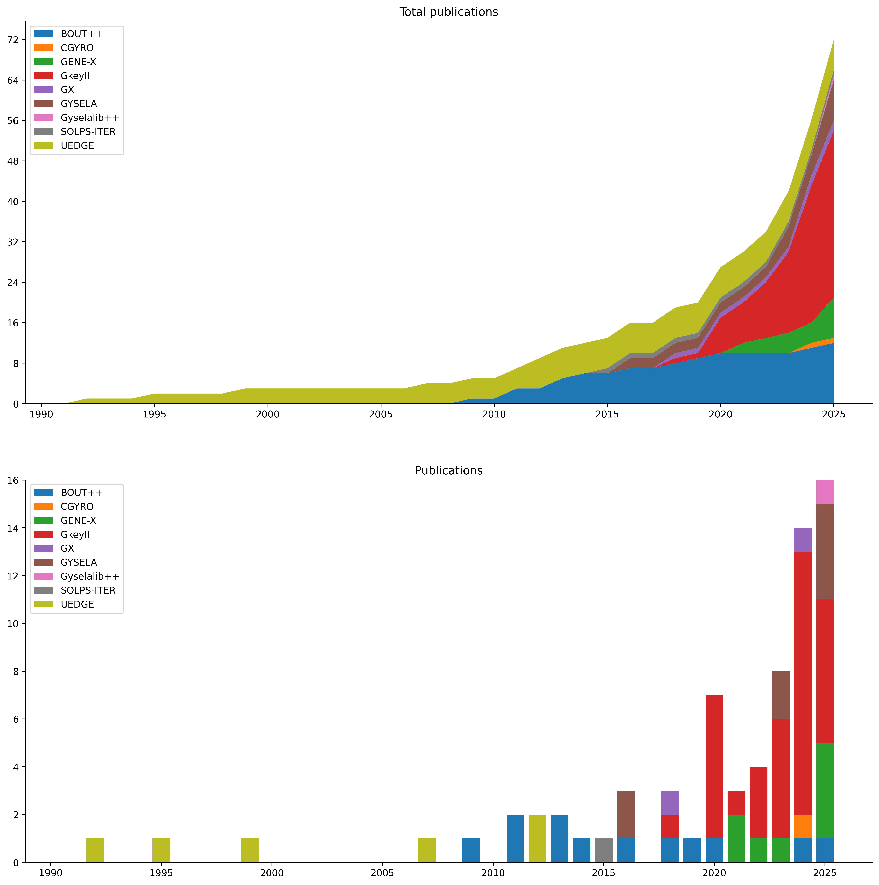

# FusionArena

## Publications

- Turbulence and transport in spectrally accelerated full-*f* gyrokinetic simulations. Frei at el. (2025) [10.1088/1741-4326/ae114a](https://doi.org/10.1088/1741-4326/ae114a)
- Spectrally accelerated edge and scrape-off layer gyrokinetic turbulence simulations. Frei at el. (2025) [10.1016/j.cpc.2025.109817](https://doi.org/10.1016/j.cpc.2025.109817)
- A moment-conserving discontinuous Galerkin representation of the relativistic Maxwellian distribution. Johnson at el. (2025) [10.1017/S0022377825100718](https://doi.org/10.1017/S0022377825100718)
- A parallel-kinetic-perpendicular-moment model for magnetised plasmas. June at el. (2025) [10.1017/S0022377825100706](https://doi.org/10.1017/S0022377825100706)
- OpenACC and OpenMP-Accelerated Fortran/C++ Gyrokinetic Fusion Code GENE-X for Heterogeneous Architectures. Trilaksono at el. (2025) [10.1145/3732775.3733587](https://doi.org/10.1145/3732775.3733587)
- Simulations of edge and SOL turbulence in diverted negative and positive triangularity plasmas. Ulbl at el. (2025) [10.1088/1741-4326/adfd70](https://doi.org/10.1088/1741-4326/adfd70)
- Conservative discontinuous Galerkin interpolation: Sheared boundary conditions. Francisquez at el. (2024) [10.1016/j.cpc.2024.109109](https://doi.org/10.1016/j.cpc.2024.109109)
- GX: a GPU-native gyrokinetic turbulence code for tokamak and stellarator design. Mandell at el. (2024) [10.1017/S0022377824000631](https://doi.org/10.1017/S0022377824000631)
- Weak baselines and reporting biases lead to overoptimism in machine learning for fluid-related partial differential equations. McGreivy and Hakim (2024) [10.1038/s42256-024-00897-5](https://doi.org/10.1038/s42256-024-00897-5)
- Influence of collisions on the validation of global gyrokinetic simulations in the edge and scrape-off layer of TCV. Ulbl at el. (2023) [10.1063/5.0144688](https://doi.org/10.1063/5.0144688)
- Full-*f* electromagnetic gyrokinetic turbulence simulations of the edge and scrape-off layer of ASDEX Upgrade with GENE-X. Michels at el. (2022) [10.1063/5.0082413](https://doi.org/10.1063/5.0082413)
- A boundary value "reservoir problem" and boundary conditions for multi-moment multifluid simulations of sheaths. Cagas at el. (2021) [10.1063/5.0024510](https://doi.org/10.1063/5.0024510)
- GENE-X: A full-*f* gyrokinetic turbulence code based on the flux-coordinate independent approach. Michels at el. (2021) [10.1016/j.cpc.2021.107986](https://doi.org/10.1016/j.cpc.2021.107986)
- Implementation and verification of a conservative, multi-species, gyro-averaged, full-*f*, Lenard-Bernstein/Dougherty collision operator in the gyrokinetic code GENE-X. Ulbl at el. (2021) [10.1002/ctpp.202100180](https://doi.org/10.1002/ctpp.202100180)
- Conservative discontinuous Galerkin scheme of a gyro-averaged Dougherty collision operator. Francisquez at el. (2020) [10.1088/1741-4326/aba0c9](https://doi.org/10.1088/1741-4326/aba0c9)
- Conservative discontinuous Galerkin schemes for nonlinear Dougherty-Fokker-Planck collision operators. Hakim at el. (2020) [10.1017/S0022377820000586](https://doi.org/10.1017/S0022377820000586)
- Alias-Free, Matrix-Free, and Quadrature-Free Discontinuous Galerkin Algorithms for (Plasma) Kinetic Equations. Hakim and Juno (2020) [10.1109/SC41405.2020.00077](https://doi.org/10.1109/SC41405.2020.00077)
- Laguerre-Hermite pseudo-spectral velocity formulation of gyrokinetics. Mandell at el. (2018) [10.1017/S0022377818000041](https://doi.org/10.1017/S0022377818000041)
- The new SOLPS-ITER code package. Wiesen at el. (2015) [10.1016/j.jnucmat.2014.10.012](https://doi.org/10.1016/j.jnucmat.2014.10.012)
- BOUT++: A framework for parallel plasma fluid simulations. Dudson at el. (2009) [10.1016/j.cpc.2009.03.008](https://doi.org/10.1016/j.cpc.2009.03.008)
- A fully implicit, time dependent 2-D fluid code for modeling tokamak edge plasmas. Rognlien at el. (1992) [10.1016/S0022-3115(06)80058-9](https://doi.org/10.1016/S0022-3115(06)80058-9)

## Datasets

- TCV-X21: an open dataset for the validation of edge turbulence models. Sales de Oliveira at el. (2024) [10.5281/zenodo.5776285](https://doi.org/10.5281/zenodo.5776285)
- TCV-X21-GENEX: influence of collisions on the validation of global gyrokinetic simulations. Ulbl at el. (2023) [10.5281/zenodo.7894730](https://doi.org/10.5281/zenodo.7894730)

## Codes

- [BOUT++](https://github.com/boutproject/BOUT-dev)
- [COGENT](https://github.com/LLNL/COGENT)
- [GENE-X](https://gitlab.mpcdf.mpg.de/phoenix-public/genex)
- [Gkeyll](https://github.com/ammarhakim/gkeyll)
- [GX](https://bitbucket.org/gyrokinetics/gx/src/gx/)
- [Gyselalib++](https://github.com/gyselax/gyselalibxx)
- [SOLPS-ITER](https://github.com/iterorganization/SOLPS-ITER)
- [TORAX](https://github.com/google-deepmind/torax)
- [UEDGE](https://github.com/llnl/UEDGE)

